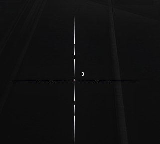

## cool-crosshairs

### Overview

`cool-crosshairs` is a small utility Lua script that allows players to customize their crosshairs in games (in CS:GO **gamesense**). The script provides users with the ability to enable multiple custom crosshairs, adjust their position, color, offset, and fade time. 

This script was designed to enhance the gameplay experience by giving users more flexibility and control over their crosshair customization. By allowing multiple crosshairs, users can set up more advanced aiming aids and visually distinct crosshairs based on their preferences.

### Features

- **Custom Crosshairs**: Choose between 1 and 10 custom crosshairs to display on screen.
- **Color Customization**: Each crosshair can be assigned its own color.
- **Position Adjustment**: Fine-tune the position of each crosshair to suit your playstyle.
- **Offset Control**: Adjust the offset distance of the crosshairs.
- **Fade Time**: Control the fade effect of the crosshairs, making them fade in or out based on zoom levels or other conditions.

### Usage

1. **Enable Custom Crosshairs**: 
   - Use the master switch to toggle the custom crosshairs feature.
   
2. **Adjust Number of Crosshairs**: 
   - You can select between 1 and 10 crosshairs using the slider, which determines how many crosshairs will be visible and customizable.

3. **Customize Each Crosshair**:
   - For each active crosshair, you can set the color, position, offset, and fade time.

4. **Display and Hide Crosshairs**:
   - The script dynamically shows or hides configuration options for the crosshairs based on your selected number, ensuring that only the necessary UI elements are visible.

### Notes

- The core functionality of the crosshair system comes from another source, but I have expanded and optimized it to create a more flexible and customizable solution.
- This script allows you to have more control over how crosshairs appear on screen and how they behave when zooming in or out.

### Disclaimer

This lua was originally written for `KnF7`.
I am not the original creator of the base crosshair system; I have simply extended it to make it more functional and customizable.

### Images

### Developers

- [**QwQ-dev**](https://github.com/QwQ-dev)
- [**KnF7**](https://github.com/KnF7xxx)